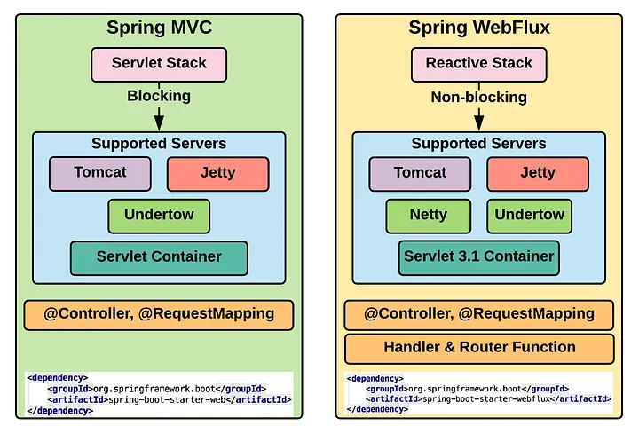

# Developing Microservices

## Servlet Stack vs Reactive Stack

Using Spring boot there is two ways to develop microservices

- Using [Servlet Stack]()
  
  Servlet API is designed to handle blocking I/O, where a thread is blocked until a response is received from a database or another service.
  **Spring Web** is well-suited for traditional web applications that require synchronous communication.

- Using [Reactive Stack](https://docs.spring.io/spring-framework/reference/web-reactive.html)

  A reactive web framework that is built on top of Reactive Streams. It is designed to handle non-blocking I/O, where a thread is not blocked while waiting for a response from a database or another service. Instead, the application can continue to process other requests while waiting for the response.
  **Spring Webflux** is well-suited for applications that require high concurrency, such as streaming applications or real-time data processing.




In both cases, the same spring annotations (@RestController, @GetMapping, etc) can be used.


### Dependencies to be used

- Servlet Stack

  Spring MVC dependency has to be added to the pom file of the project

  ```xml
  <dependency>
    <groupId>org.springframework.boot</groupId>
    <artifactId>spring-boot-starter-web</artifactId>
  </dependency>
  ```

- Reactive Stack

  Spring Webflux dependency has to be added to the pom file of the project

  ```xml
  <dependency>
    <groupId>org.springframework.boot</groupId>
    <artifactId>spring-boot-starter-webflux</artifactId>
  </dependency>
  ```
  
## Implementing REST API

- Define DTOs
  Data Transfer Object (DTO) as it is used to transfer data between the API implementation and the caller of the API
  It is a POJO class.

  ```java
  package com.ricsanfre.microservices.api.core.product;
  
  public class Product {
  private final int productId;
  private final String name;
  private final int weight;
  private final String serviceAddress;
  
      public Product(int productId, String name, int weight, String serviceAddress) {
          this.productId = productId;
          this.name = name;
          this.weight = weight;
          this.serviceAddress = serviceAddress;
      }
  
      public int getProductId() {
          return productId;
      }
  
      public String getName() {
          return name;
      }
  
      public int getWeight() {
          return weight;
      }
  
      public String getServiceAddress() {
          return serviceAddress;
      }
  }  
  ```
- Define API interfaces
  Java interfaces defining the API. This interface need to be implemented by the RestController class.

  Methods need to be annotated with corresponding [mapping request annotations](https://docs.spring.io/spring-framework/reference/web/webmvc/mvc-controller/ann-requestmapping.html)
  - @GetMapping
  - @PostMapping
  - @PutMapping
  - @DeleteMapping
  - @PatchMapping

  ```java
  package com.ricsanfre.microservices.api.core.product;

  import org.springframework.web.bind.annotation.GetMapping;
  import org.springframework.web.bind.annotation.PathVariable;

  public interface ProductService {

    /**
     * Sample usage: "curl $HOST:$PORT/product/1".
     *
     * @param productId Id of the product
     * @return the product, if found, else null
     */

    @GetMapping(
            value = "/product/{productId}",
            produces = "application/json"
    )
    Product getProduct(@PathVariable("productId") int productId);
  }
  ```
  
- Define RestController implementation

  Java class with @RestControler annotation implementing the API interface

  ```java
  package com.ricsanfre.microservices.core.product.services;
  
  import com.ricsanfre.microservices.api.core.product.Product;
  import com.ricsanfre.microservices.api.core.product.ProductService;
  import org.springframework.web.bind.annotation.RestController;
  
  @RestController
  public class ProductServiceImpl implements ProductService {
 
      @Override
      public Product getProduct(int productId) {
          return new Product(productId, "name-" + productId, 123,
                  "serviceAddress");
      }
  }

  ```

## Adding Logging

Spring Boot, as a framework, incorporates a flexible and efficient [logging system](https://docs.spring.io/spring-boot/docs/current/reference/htmlsingle/#features.logging) based on SLF4J, Simple Logging Facade for Java.
SLF4J isn’t a logging implementation in itself but serves as a facade or an abstraction layer for various logging libraries like Logback, Log4J,

Spring boot uses Logbak as default logging when adding `spring-boot-starter-web` dependency (Springboot MVC)

Default configuration outputs logs to console. This default configuration is useful in Kubernetes environments.
See [Springboot Logging Reference documentation](https://docs.spring.io/spring-boot/docs/current/reference/htmlsingle/#features.logging)


- Adding logs within Java Classes
  ```java
  
  
  import org.slf4j.Logger;
  import org.slf4j.LoggerFactory;
  import org.springframework.web.bind.annotation.GetMapping;
  import org.springframework.web.bind.annotation.PathVariable;
  import org.springframework.web.bind.annotation.RestController;
  
  @RestController
  public class HelloController {
  
      // Get the SLF4J logger interface, default Logback, a SLF4J implementation
      private static final Logger logger = LoggerFactory.getLogger(HelloController.class);
  
      @GetMapping("/")
      public String hello() {
  
          // log to console (default)
  
          logger.debug("Debug level - Hello Logback");
  
          logger.info("Info level - Hello Logback");
          
          logger.error("Error level - Hello Logback");
  
          return "Hello SLF4J";
      }
  
  }
  ```
  
- Configure log levels

  Different logs levels can be configured in `application.yaml` file

  logging.level.<logger-name>=<level> 
  where <level> is one of TRACE, DEBUG, INFO, WARN, ERROR, FATAL, or OFF.
  and <logger-name> is a package or class name
  The root logger can be configured by using logging.level.root.

  ```yaml
  # Logging configuration
  
  # Default logging level is INFO
  # logging level for classes within package com.ricsanfre.microservices is DEBUG
  logging:
    level:
      root: INFO
      com.ricsanfre.microservices: DEBUG
  ```
  
## Implementing REST Client

Use [Spring Cloud OpenFeign](https://docs.spring.io/spring-cloud-openfeign/docs/current/reference/html/) for implementing declarative REST Clients

- Add OpenFeign dependencies to pom.xml

  ```xml
  <dependency>
      <groupId>org.springframework.cloud</groupId>
      <artifactId>spring-cloud-starter-openfeign</artifactId>
  </dependency>  
  ```
  
-  Define OpenFeign client Interface
   
   The interface can extend the one used for defining the service.
   See [Open Feign inheritance support](https://docs.spring.io/spring-cloud-openfeign/docs/current/reference/html/#spring-cloud-feign-inheritance)

   ```java
   package com.ricsanfre.microservices.api.core.product;

   import org.springframework.cloud.openfeign.FeignClient;
    
   @FeignClient(
       name = "product",
       url = "${app.product.url}"
   )
   public interface ProductClient extends ProductService{
   }
   ```
  - Add @EnableFeignClients annotation to main application

    ```java
    package com.ricsanfre.microservices.composite.product;
    
    import org.springframework.boot.SpringApplication;
    import org.springframework.boot.autoconfigure.SpringBootApplication;
    import org.springframework.cloud.openfeign.EnableFeignClients;
    
    @SpringBootApplication
    @EnableFeignClients(
        basePackages = "com.ricsanfre.microservices.api"
    )
    public class ProductCompositeServiceApplication {
    public static void main(String[] args) {
    
            SpringApplication.run(ProductCompositeServiceApplication.class, args);
        }
    } 
    ```
    
  - Add clients urls to `application.yaml` 
  
    ```yaml
    # Microservices URL
    app:
      product:
        url: http://localhost:8081
    ```
    
## Error Handling

### Spring boot default implementation

Spring Boot MVC provides an ErrorController implementation to handle errors in a sensible way.

It serves a fallback error page for browsers (a.k.a. the Whitelabel Error Page) and a JSON response for RESTful, non-HTML requests:

Every exception happening is converted into Internal Server Error HTTP response (code 500)
```json
{
  "timestamp": "2019-01-17T16:12:45.977+0000",
  "status": 500,
  "error": "Internal Server Error",
  "message": "Error processing the request!",
  "path": "/my-endpoint-with-exceptions"
}
```

Spring Boot allows to include details of the original exception in the response message:

```yaml
server:
  error:
    include-stacktrace: always # includes the stacktrace in both the HTML and the JSON default response
    include-message: always # since version 2.3, Spring Boot hides the message field in the response to avoid leaking sensitive information
```

A class annotated with @ControllerAdvice can be defined to customize the JSON document to return for a particular controller and/or exception type

### Adding GlobalExceptionHandler

Create a class annotated with @ControllerAdvice to handle or Exceptions and generate a customizes JSON API response message


- Create a customized API Response record

  ```java
  package com.ricsanfre.microservices.api.errors;
  
  import org.springframework.http.HttpStatus;
  
 
  public record ApiErrorResponse (
    String timestamp,
    String path,
    HttpStatus httpStatus,
    String message ) {

  }  
  ```

- Create GlobalControllerExceptionHandler annotated with @ControllerAdvice
  
  ```java
  package com.ricsanfre.microservices.util.http;
  
  import com.ricsanfre.microservices.api.errors.ApiErrorResponse;
  import com.ricsanfre.microservices.api.errors.exceptions.NotFoundException;
  import jakarta.servlet.http.HttpServletRequest;
  import org.slf4j.Logger;
  import org.slf4j.LoggerFactory;
  import org.springframework.http.HttpStatus;
  import org.springframework.http.ResponseEntity;
  import org.springframework.web.bind.annotation.ControllerAdvice;
  import org.springframework.web.bind.annotation.ExceptionHandler;
  
  import java.time.ZonedDateTime;
  
  @ControllerAdvice
  public class GlobalControllerExceptionHandler {
  
      private static final Logger LOG = LoggerFactory.getLogger(GlobalControllerExceptionHandler.class);
  
      @ExceptionHandler(value = NotFoundException.class)
      public ResponseEntity<Object> handleResourceNotFoundException(
              NotFoundException e,
              HttpServletRequest request) {
          ApiErrorResponse apiErrorResponse = new ApiErrorResponse(
                  ZonedDateTime.now().toOffsetDateTime().toString(),
                  request.getRequestURI(),
                  HttpStatus.NOT_FOUND,
                  e.getMessage()
  
          );
          return new ResponseEntity<>(apiErrorResponse, HttpStatus.NOT_FOUND);
      }  
  }
  ```  

### Handling OpenFeign Errors

OpenFeign clients whenever a HTTP error code is received, it triggers a generic FeignException hiding the original error response

```
feign.FeignException$NotFound: [404] during [POST] to [http://localhost:8080/upload-error-1] [UploadClient#fileUploadError(MultipartFile)]: [{"timestamp":"2022-02-18T13:25:22.083+00:00","status":404,"error":"Not Found","path":"/upload-error-1"}]
	at feign.FeignException.clientErrorStatus(FeignException.java:219) ~[feign-core-11.7.jar:na]
	at feign.FeignException.errorStatus(FeignException.java:194) ~[feign-core-11.7.jar:na]

```

A custom decoder can be defined to get information from original Error response and trigger a custom Exception

- Create CustomDecoder

  ```java
  package com.ricsanfre.microservices.api.errors;
  
  import com.fasterxml.jackson.databind.ObjectMapper;
  import com.ricsanfre.microservices.api.errors.exceptions.NotFoundException;
  import feign.Response;
  import feign.codec.ErrorDecoder;
  
  import java.io.IOException;
  import java.io.InputStream;
  
  public class RetrieveMessageErrorDecoder implements ErrorDecoder {
  
      private final ErrorDecoder errorDecoder = new Default();
  
      @Override
      public Exception decode(String methodKey, Response response) {
  
          ApiErrorResponse message = null;
          try (InputStream bodyIs = response.body().asInputStream()) {
              ObjectMapper mapper = new ObjectMapper();
              message = mapper.readValue(bodyIs, ApiErrorResponse.class);
          } catch (IOException e) {
              return new Exception(e.getMessage());
          }
          switch (response.status()) {
              // NOT_FOUND
              case 404:
                  return new NotFoundException(message.message() != null ? message.message() : "Not found");
              // BAD_REQUEST
              case 400:
                  return new IllegalArgumentException(message.message() != null ? message.message() : "Bad Request");
              default:
                  return errorDecoder.decode(methodKey, response);
          }
      }
  }  
  ```

- Configure OpenFeign client to use custom decoder

  ```java
  package com.ricsanfre.microservices.api.core.product;
  
  import com.ricsanfre.microservices.api.errors.RetrieveMessageErrorDecoder;
  import org.springframework.cloud.openfeign.FeignClient;
  
  @FeignClient(
  name = "product",
  url = "${app.product.url}",
  configuration = {RetrieveMessageErrorDecoder.class}
  )
  public interface ProductRestClient extends ProductRestService {
  
  }  
  ```

### References

- [Spring boot MVC error-handling](https://docs.spring.io/spring-boot/docs/current/reference/htmlsingle/#web.servlet.spring-mvc.error-handling)
- [Error Handling for REST with Spring](https://www.baeldung.com/exception-handling-for-rest-with-spring)
- [Retrieve Original Message From Feign ErrorDecoder](https://www.baeldung.com/feign-retrieve-original-message)
- [Propagating Exceptions With OpenFeign and Spring](https://www.baeldung.com/spring-openfeign-propagate-exception)


## Integration Testing

Testing SpringBoot application with a running server requires web-flux.
See documentation [Testing with running server](https://docs.spring.io/spring-boot/docs/current/reference/htmlsingle/#features.testing.spring-boot-applications.with-running-server)

- Add Webflux dependency to pom.xml, only test scope

  ```xml
  <!-- Webflux for integration testing
     https://docs.spring.io/spring-boot/docs/current/reference/htmlsingle/#features.testing.spring-boot-applications.with-running-server
     Integration Test with running server requires web-flux
  -->
  <dependency>
    <groupId>org.springframework.boot</groupId>
    <artifactId>spring-boot-starter-webflux</artifactId>
    <scope>test</scope>
  </dependency>
  ```

- Create Java class containing integration tests

  ```java
  @SpringBootTest(webEnvironment = SpringBootTest.WebEnvironment.RANDOM_PORT)
  public class ProductServiceApplicationTests {
  
      @Autowired
      private WebTestClient webTestClient; 
  
      @Test
      void exampleTest() {
          webClient
            .get().uri("/")
            .exchange()
            .expectStatus().isOk()
            .expectBody(String.class).isEqualTo("Hello World");
      }
  }
  ```

### References
- [Spring-boot testing doc](https://docs.spring.io/spring-boot/docs/current/reference/htmlsingle/#features.testing)

## Open Api

Use OpenAPI Specification to document APIs

`springdoc-openapi` java library helps to automate the generation of API documentation using spring boot projects

Adding the following dependency, swagger UI is added. 

```xml
<dependency>
  <groupId>org.springdoc</groupId>
  <artifactId>springdoc-openapi-starter-webmvc-ui</artifactId>
  <version>2.3.0</version>
</dependency>
```

Add the following to application.yaml for configuring the openapi docs

```yaml
# Open API
springdoc:
  # Make swagger and open api doc available under /openapi path
  swagger-ui.path: /openapi/swagger-ui.html
  api-docs.path: /openapi/v3/api-docs
  # Reduce packages to scan looking for openapi annotations
  packagesToScan: com.ricsanfre.microservices.composite.product
  pathsToMatch: /**
```

Open API description files:
 - JSON file is available at `/openapi/v3/api-docs`
 - YAML file is available at `/openapi/v3/api-docs.yaml`

Swagger UI available at `/openapi/swagger-ui.html`

### References

- [Open API 3.0 for Spring boot](https://springdoc.org/)
- [Documenting a Spring REST API Using OpenAPI 3.0](https://www.baeldung.com/spring-rest-openapi-documentation)


## Persistence Layer

SQL and non-sql databases can be used to add a persistence layer to the microservices

The following Spring/Java technologies will be used

- Spring Data JPA (Java Persistence API) for microservices using SQL databases (i.e PosgreSQL).
  See details in [Spring boot reference documentation: Data SQL databases](https://docs.spring.io/spring-boot/docs/current/reference/htmlsingle/#data.sql)
  
- Other Spring Data Modules for using non SQL databases
  See details in [Spring boot reference documentation: Non SQL databases](https://docs.spring.io/spring-boot/docs/current/reference/htmlsingle/#data.nosql)
  In case of MongoDB, Spring Data for MongoDB is used

- Java beans Mapping library, [MapStruct](https://mapstruct.org/), to automate the mapping process between DAO (Data Access Objects), java beans used in pesistence layer, and DTO (Data Transfer Objects), java beans used in the interface/API

- [TestContainers](https://java.testcontainers.org/) for automating integration testing
  Testing DB with lightweight containers

### PostgreSQL

#### Adding dependencies
- Adding Spring JPA
  ```xml
  <dependency>
    <groupId>org.springframework.boot</groupId>
    <artifactId>spring-boot-starter-data-jpa</artifactId>
  </dependency>
  ```
- Adding PosgreSQL drivers
  ```xml
  <dependency>
    <groupId>org.postgresql</groupId>
    <artifactId>postgresql</artifactId>
    <scope>runtime</scope>
  </dependency>  
  ```

#### Adding PosgreSQL dev environment

Using docker compose. Add following service:

```yaml
services:
  postgres:
    container_name: postgres
    image: postgres
    environment:
      POSTGRES_USER: review
      POSTGRES_PASSWORD: password
      POSTGRES_DB: review
      PGDATA: /data/postgres
    volumes:
      - postgres:/data/postgres
    ports:
      - "5432:5432"
    networks:
      - db
    restart: unless-stopped
networks:
  db:
    driver: bridge
volumes:
  postgres: 
```
  
#### Configuring Data Source

Add PosgreSQL data source to `application.yaml`
```yaml
spring:
  # PostgreSQL  backend
  datasource:
    password: password
    url: jdbc:postgresql://localhost:5432/review
    username: review
  # JPA configuration
  jpa:
    hibernate:
      ddl-auto: create-drop
    properties:
      hibernate:
        dialect: org.hibernate.dialect.PostgreSQLDialect
        format_sql: true
    show-sql: true
```

#### Start data base and configure it

1. Start posgreSQL docker service using docker compose

   ```shell
   docker compose up -d posgres
   ```

2. Connect to PosgreSQl docker image to initialize DB

   ```shell
   docker exec -it postgres bash
   ```

3. Initialize postgreSQL database using interactive PosgreSQL cli

   ```shell
   psql -U review
   
   CREATE DATABASE review;
   ```

Other postgreSQL commands

   Connect to specific database
   ```shell
   psql -U review -d database
   ```

   psql commands:
   ```
   \l : list all databases
   \q : exit
   \d : describe
   \c : conect to a database
   \dt : list relations
   ```


### MongoDB

- Adding Spring Data for MongoDB

  ```xml
  <dependency>
      <groupId>org.springframework.boot</groupId>
      <artifactId>spring-boot-starter-data-mongodb</artifactId>
  </dependency>  
  ```

#### Adding MongoDB dev environment

Using docker compose. Add following service:

```yaml
services:
  mongodb:
    container_name: mongo
    image: mongo:7.0.8
    environment:
      MONGO_INITDB_ROOT_USERNAME: ricsanfre
      MONGO_INITDB_ROOT_PASSWORD: password
    volumes:
      - mongo:/data
    ports:
      - "27017:27017"
    networks:
      - db
    restart: unless-stopped
networks:
  db:
    driver: bridge
volumes:
  mongo:
```

#### Configuring Data Source

Add Mongo data source to `application.yaml`
```yaml
spring:
  data:
    mongodb:
      username: ricsanfre
      password: password
      host: localhost
      port: 27017
      database: database_name
      authentication-database: admin
```

#### About automatic creation of MongoDB Indexes

Spring Data MongoDB can automatically create indexes for entity types annotated with @Document. Index creation must be explicitly enabled since version 3.0.

Indexes can be created programmatically on startup.

Following class define a listener that execute the creation of all indexes on startup.

```java
package com.ricsanfre.microservices.core.product.db.index;

import org.springframework.context.event.ContextRefreshedEvent;
import org.springframework.context.event.EventListener;
import org.springframework.data.mapping.context.MappingContext;
import org.springframework.data.mongodb.core.MongoTemplate;
import org.springframework.data.mongodb.core.index.IndexOperations;
import org.springframework.data.mongodb.core.index.IndexResolver;
import org.springframework.data.mongodb.core.index.MongoPersistentEntityIndexResolver;
import org.springframework.data.mongodb.core.mapping.Document;
import org.springframework.data.mongodb.core.mapping.MongoPersistentEntity;
import org.springframework.data.mongodb.core.mapping.MongoPersistentProperty;
import org.springframework.stereotype.Component;

@Component
public class IndexManager {

  private final MongoTemplate mongoTemplate;

  public IndexManager(MongoTemplate mongoTemplate) {
    this.mongoTemplate = mongoTemplate;
  }

  // Create MongoDB indices on startup
  // https://docs.spring.io/spring-data/mongodb/reference/mongodb/mapping/mapping-index-management.html
  @EventListener(ContextRefreshedEvent.class)
  public void initIndicesAfterStartup() {

    MappingContext<? extends MongoPersistentEntity<?>, MongoPersistentProperty> mappingContext = mongoTemplate
            .getConverter().getMappingContext();

    IndexResolver resolver = new MongoPersistentEntityIndexResolver(mappingContext);
    // consider only entities that are annotated with @Document
    mappingContext.getPersistentEntities()
            .stream()
            .filter(it -> it.isAnnotationPresent(Document.class))
            .forEach(it -> {

              IndexOperations indexOps = mongoTemplate.indexOps(it.getType());
              resolver.resolveIndexFor(it.getType()).forEach(indexOps::ensureIndex);
            });
  }
}
```

See details in [Spring-MongoDB Reference document](https://docs.spring.io/spring-data/mongodb/reference/mongodb/mapping/mapping-index-management.html)


#### Start data base and configure it

1. Start mongodb docker service using docker compose

   ```shell
   docker compose up -d mongodb
   ```

2. Connect to MongoDB docker image to initialize DB using mongoshell

   ```shell
   docker exec -it mongo mongosh -u ricsanfre
   ```

3. Initialize mongodb database using mongoshell

   ```shell
   use 
   ```

Other mongoshell commands

- List databases
  ```shell
  show dbs
  ```
- Start working with a specific database
  ```shell
  use products;
  ```
- Show collections
  ```shell
  show collections
  ```
- Show indices
  ```shell
  db.<collection>.getIndexes()
  ```

### MapStruct

- Add dependencies

  ```xml
  <properties>
    <org.mapstruct.version>1.5.5.Final</org.mapstruct.version>
  </properties>
  <dependencies>
      <dependency>
        <groupId>org.mapstruct</groupId>
        <artifactId>mapstruct</artifactId>
        <version>${org.mapstruct.version}</version>
      </dependency>
  </dependencies>
  ```
  
- Configure maven compiler to add mapstruct annotations

  ```xml
  <build>
      <plugins>
          <plugin>
              <groupId>org.apache.maven.plugins</groupId>
              <artifactId>maven-compiler-plugin</artifactId>
              <version>3.8.1</version>
              <configuration>
                  <source>1.8</source> <!-- depending on your project -->
                  <target>1.8</target> <!-- depending on your project -->
                  <annotationProcessorPaths>
                      <path>
                          <groupId>org.mapstruct</groupId>
                          <artifactId>mapstruct-processor</artifactId>
                          <version>${org.mapstruct.version}</version>
                      </path>
                      <!-- other annotation processors -->
                  </annotationProcessorPaths>
              </configuration>
          </plugin>
      </plugins>
  </build>  
  ```

See further details in [MapStruct installation instructions](https://mapstruct.org/documentation/installation/)

### TestContainers

See installation details in [Testcontainers - JUnit5](https://java.testcontainers.org/quickstart/junit_5_quickstart/)

- Add dependencies to pom.xml

  ```xml
  <properties>
    <testcontainers.version>1.19.7</testcontainers.version>
  </properties>
  <dependencies>
    <dependency>
      <groupId>org.testcontainers</groupId>
      <artifactId>testcontainers</artifactId>
      <version>${testcontainers.version}</version>
      <scope>test</scope>
    </dependency>
    <dependency>
        <groupId>org.testcontainers</groupId>
        <artifactId>junit-jupiter</artifactId>
        <version>${testcontainers.version}</version>
        <scope>test</scope>
    </dependency>
    <dependency>
        <groupId>org.testcontainers</groupId>
        <artifactId>postgresql</artifactId>
        <version>${testcontainers.version}</version>
    </dependency>
    <dependency>
        <groupId>org.testcontainers</groupId>
        <artifactId>mongodb</artifactId>
        <version>${testcontainers.version}</version>
    </dependency>
  </dependencies>  
  ```
### References

- [Spring boot Data: Reference doc](https://docs.spring.io/spring-boot/docs/current/reference/htmlsingle/#data)
- [Spring data for MongoDB](https://spring.io/projects/spring-data-mongodb)
- [Spring data for JPA](https://spring.io/projects/spring-data-jpa)
- [MapStruct](https://mapstruct.org/)